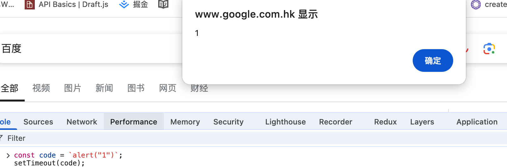
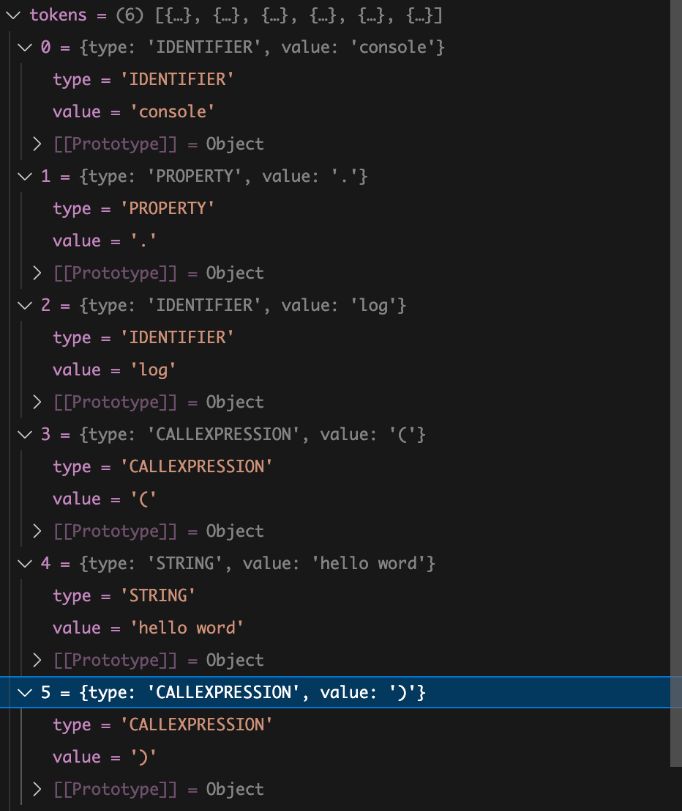
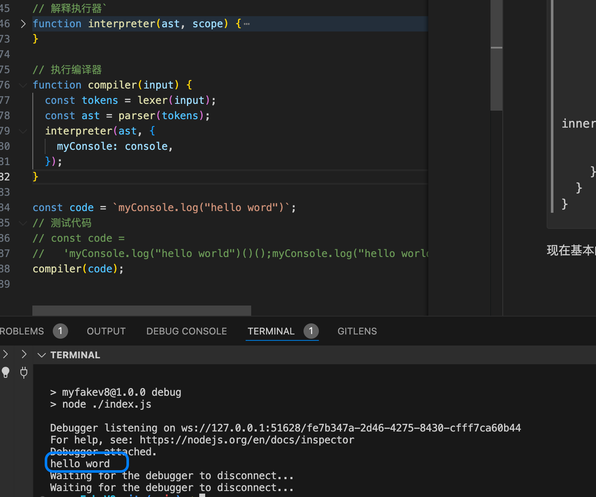
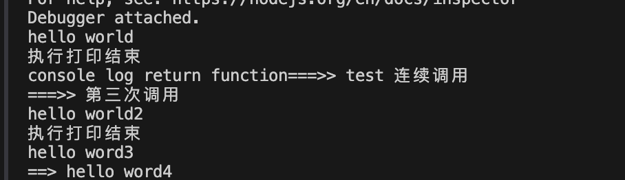

# 如何将一个 js 字符串当作代码运行？

有这样一个`console.log("hello word")`字符串，如何执行它，并且让浏览器打印 `hello word"` 。

可能你首先相当的是 eval、new function 亦或者是 setTimeout

- eval | new Function
  ```javascript
  const code = `console.log("hello word")`;
  eval(code);
  const fn = new Function(code);
  fn();
  ```
- setTimeout

  

  这些方法都可以实现，但是如果是执行 myConsole.log("hello word") 打印出 hello word" 你会怎么做呢？
  参考一下 v8 的做法

分词解析(扫描) => 词法分析 => 生成语法树 => 作用域 => 执行

按照这样的思路我们来实现一版简单的字符串执行逻辑。

```
const code = `console.log("hello word")`
```

首先我们需要知道有字符串的结构，也就是分词，这个步骤可以按照状态机或者正则来解析,就这个字符串而言它有 标识符、属性读取、函数调用、字符串。
我们可以定义一个 token 结构
token:
{
type: 类型,
value: 值,
}
拆分 console.log("hello word")`
console： 标识符
.log： .是属性读取，log 是具体的属性值
()： 函数调用
"hello word"： 字符串

现在我们来实现这个逻辑

分词解析，获取 token：

```javascript
const TokenType = {
  IDENTIFIER: "IDENTIFIER", // 标识符
  STRING: "STRING", // 字符
  CALL: "CALLEXPRESSION", // 函数调用
  PROPERTY: "PROPERTY", // 属性读取
};
function lexer(input) {
  const tokens = [];
  let current = 0;

  while (current < input.length) {
    let char = input[current];

    if (char === "(" || char === ")") {
      tokens.push({
        type: TokenType.CALL,
        value: char,
      });
      current++;
      continue;
    }
    if (char === "." || char === "[" || char === "]") {
      tokens.push({
        type: TokenType.PROPERTY,
        value: char,
      });
      current++;
      continue;
    }
    if (char === '"') {
      let value = "";
      char = input[++current];
      while (char !== '"') {
        value += char;
        char = input[++current];
      }
      tokens.push({
        type: TokenType.STRING,
        value,
      });
      current++;
      continue;
    }
    if (/[a-zA-Z]/.test(char)) {
      let value = "";

      while (/[a-zA-Z]/.test(char)) {
        value += char;
        char = input[++current];
      }

      tokens.push({
        type: TokenType.IDENTIFIER,
        value,
      });
      continue;
    }
    current++;
  }

  return tokens;
}
```

好了，按照这个步骤我们得到了这样的 token 列表。



现在我们需要将用这些 token 生成语法树。【也可以一边解析 token 一边生成语法树（可以参考 babel）】

生成语法树：
我们定义程序的开始是 body 节点：

```javascript
const ast = { body: [] };
```

将 token 转换成语法树节点：

```javascript
function parser(tokens) {
  let current = 0;
  const ast = { body: [] };
  function walk() {
    let token = tokens[current];
    if (token.type === TokenType.STRING) {
      current++;
      return {
        type: "StringLiteral",
        value: token.value,
      };
    }

    if (token.type === TokenType.IDENTIFIER) {
      current++;
      let nextToken = tokens[current];
      if (nextToken && nextToken.type === TokenType.PROPERTY) {
        current++;
        return {
          type: "Identifier",
          name: token.value,
          property: walk(),
        };
      }

      if (
        nextToken &&
        nextToken.type === TokenType.CALL &&
        nextToken.value === "("
      ) {
        function getFunctionCallNode() {
          const node = {
            type: "CallExpression",
            name: token.value,
            params: [],
          };
          token = tokens[++current];
          while (
            !(token && token.type === TokenType.CALL && token.value === ")")
          ) {
            node.params.push(walk());
            token = tokens[current];
          }
          nextToken = tokens[current + 1];
          if (
            nextToken &&
            nextToken.type === TokenType.CALL &&
            nextToken.value === "("
          ) {
            current++;
            node.child = {
              ...getFunctionCallNode(),
              name: undefined,
            };
          }
          return node;
        }
        const node = getFunctionCallNode();
        return node;
      }
      return {
        type: "Identifier",
        name: token.value,
      };
    }
    current++;
    return null;
  }
  while (current < tokens.length) {
    const node = walk();
    if (node) {
      ast.body.push(node);
    }
  }
  return ast;
}
```

生成语法树后就是执行代码逻辑了，但最终的内置函数逻辑还是原生浏览器实现，所以我们有一个语法环境，用来存储浏览器实现的内置函数逻辑。

可以是一个对象
{
myConsole: console
}

现在我们的编译逻辑可以是这样

```javascript
// 执行编译器
function compiler(input) {
  const tokens = lexer(input);
  const ast = parser(tokens);
  interpreter(ast, {
    myConsole: console,
  });
}
```

目前还缺少一个执行器 interpreter 的实现逻辑。
分析一下 interpreter 需要根据 ast 和提供的语法环境 执行对应的代码逻辑：

```javascript
function interpreter(ast, scope) {
  for (let i = 0; i < ast.body.length; i++) {
    const node = ast.body[i];
    recursion(node, scope);
  }

  function recursion(node, innerScope, returnFn) {
    switch (node.type) {
      case "CallExpression":
        const params = node.params.map((param) => {
          return recursion(param, innerScope);
        });
        const fn = node.name ? innerScope[node.name] : returnFn;
        const returnValue = fn?.(...params);
        if (node.child) {
          return recursion(node.child, innerScope, returnValue);
        }
        break;
      case "StringLiteral":
        return node.value;
      case "Identifier":
        if (node.property) {
          return recursion(node.property, innerScope[node.name]);
        }
        return innerScope[node.name];
    }
  }
}
```

现在基本的逻辑已经完成了 我们来验证一下



尝试一下复杂点的逻辑，函数多次调用和变量

```javascript
function compiler(input) {
  const tokens = lexer(input);
  const ast = parser(tokens);
  interpreter(ast, {
    myConsole: {
      log: (...params) => {
        console.log(...params);
        console.log("执行打印结束");
        return () => {
          console.log("console log return function===>> test 连续调用");
          return () => {
            console.log("===>> 第三次调用");
          };
        };
      },
    },
    testLog: console.log,
    globalValue: "==> hello word4",
  });
}
// 测试代码
const code =
  'myConsole.log("hello world")()();myConsole.log("hello world2");testLog("hello word3");testLog(globalValue)';
compiler(code);
```

可以看到执行结果和我们预期一致

